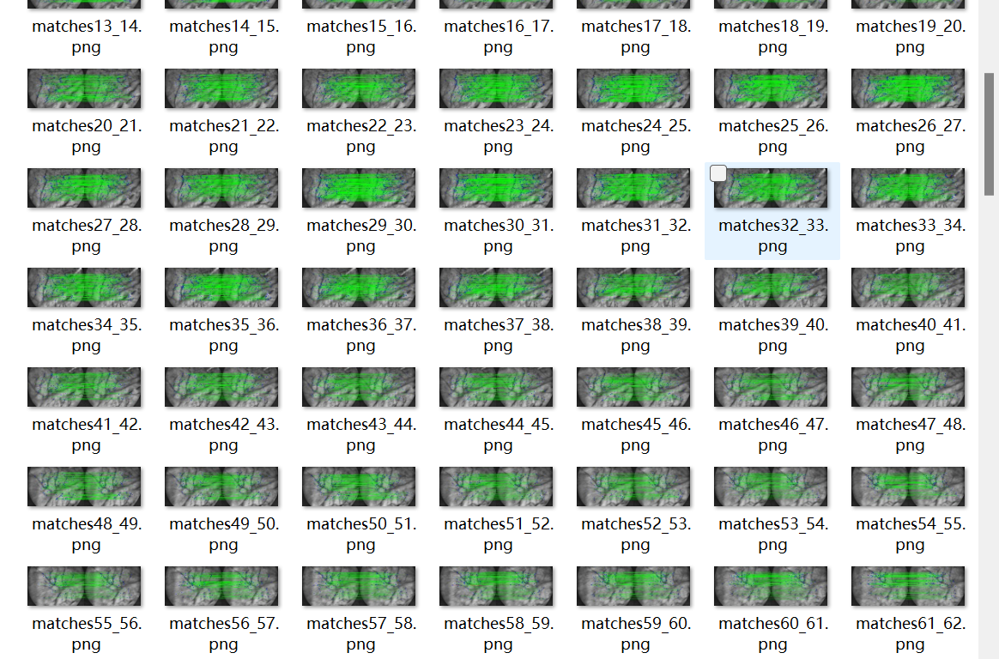
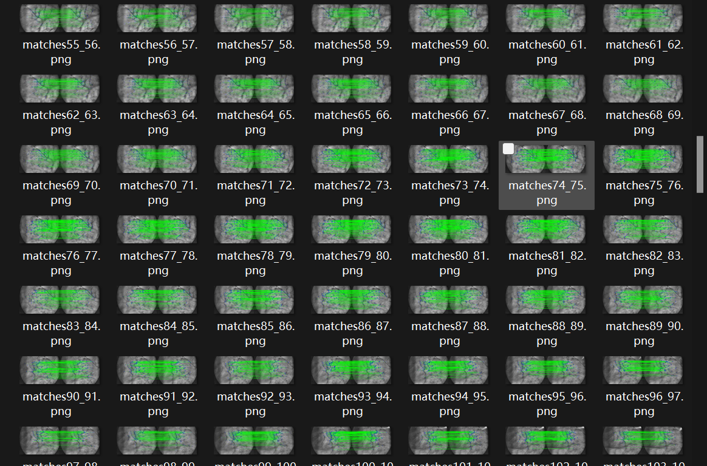
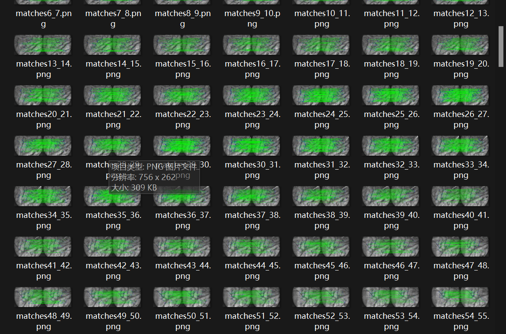
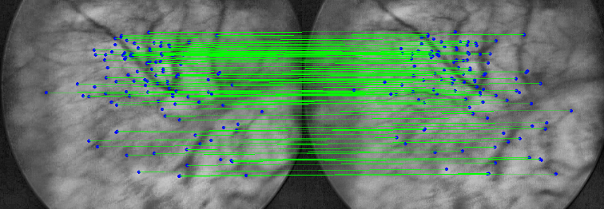
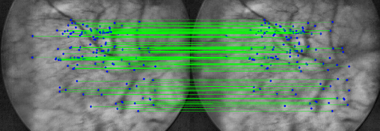
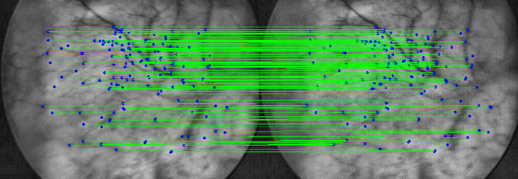

# 第三题

> 目录
>
> + [题目](#1)
> + [代码框架](#2)
> + [项目简介](#3)
> + [代码](#4)
>   + [数据集部分](#4.1)
>     + [dataLoader.py](#4.1.1)
>     + [run_generate_triplet_dataset.py](#4.1.2)
>   + [模型部分](#4.2)
>     + [hardnet_model.py](#4.2.1)
>     + [train_model.py](#4.2.2)
>   + [训练部分](#4.3)
>     + [run_training.py](#4.3.1)
>   + [测试部分](#4.4)
>     + [run_validation.py](#4.4.1)
>     + [run_matching_demo.py](#4.4.2)
> + [结果](#5)

## <a id='1'>题目</a>

按照所给代码框架，将 Self-supervised endoscopic image key-points matching代码改写为我们自己的框架结构。

## <a id='2'>代码框架</a>

```
D:.
│  main.py
│
├─.idea
│  │  .gitignore
│  │  misc.xml
│  │  modules.xml
│  │  my_project.iml
│  │  workspace.xml
│  │
│  └─inspectionProfiles
│          profiles_settings.xml
│          Project_Default.xml
│
├─configs
│  │  config_loader.py
│  │
│  └─__pycache__
│          config_loader.cpython-39.pyc
│
├─data
│      test_dataset.zip
│      train_dataset.zip
│
├─output
│  │  HardNet128.pth
│  │
│  └─HardNet128
├─part1_data
│  │  dataLoader.py
│  │  run_generate_triplet_dataset.py
│  │
│  └─__pycache__
│          dataLoader.cpython-39.pyc
│
├─part2_model
│  │  arch_factory.py
│  │
│  ├─loss
│  │  │  loss.py
│  │  │  triplet_loss_layers.py
│  │  │
│  │  └─__pycache__
│  │          triplet_loss_layers.cpython-39.pyc
│  │
│  ├─models
│  │  │  hardnet_model.py
│  │  │  hynet_model.py
│  │  │  sosnet_model.py
│  │  │
│  │  └─__pycache__
│  │          hardnet_model.cpython-39.pyc
│  │
│  ├─train_model
│  │  │  train_model.py
│  │  │
│  │  └─__pycache__
│  │          train_model.cpython-39.pyc
│  │
│  └─__pycache__
├─part3_train
│      run_training.py
│
├─part4_test
│      run_matching_demo.py
│      run_validation.py
│
└─utils
        image_keypoints_extractors.py
        matcher.py
        path.py
```

## <a id='3'>项目简介</a>

+ config_loader.py: 定义和解析配置参数

  定义了一个配置解析器，用于解析项目的各种参数。这些参数控制着训练、匹配演示等不同阶段的行为。可以通过修改这些参数来自定义项目的行为。

+ dataLoader.py: 定义了两个数据集类：TripletDataset和PatchDataset。

  + TripletDataset:

    这个类用于加载包含三元组样本的数据集。每个样本包含一个锚点图像、一个正例图像和一个负例图像。锚点和正例是同一场景的不同视角，而负例是另一场景。数据集的目录结构应该按照每个场景存储，并且每个场景下有三个图像：锚点（以"a"开头）、正例（以"p"开头）和负例（以"n"开头）。类提供了对数据集的索引、加载和图像变换等功能。

  + PatchDataset:

    这个类用于加载稀疏对应关系数据集，通常用于特征匹配等任务。它从文件中加载场景的所有匹配，并生成用于训练的图像块。每个样本包含源图像、目标图像、源图像块、目标图像块、源图像关键点和目标图像关键点。这个数据集假定数据集的目录结构是按场景存储的，每个场景都包含一个matches目录，其中包含所有场景的匹配文件。脚本还提供了一个简单的图像增强函数enhance，用于对输入图像进行预处理。

+  run_generate_triplet_dataset.py

  生成用于训练图像匹配模型的训练数据。每个三元组包括一个锚点图像、一个正例图像和一个负例图像，其中锚点和正例图像来自同一场景，而负例图像来自另一场景。这样的数据有助于模型学习对图像中的特征进行匹配。

+ hardnet_model.py

  一个包含 HardNet128 模型的模块. 定义了 HardNet128 模型结构，包括特征提取部分和一些辅助方法，如输入归一化和权重初始化。此外，还包含 L2 范数归一化的模块。

+ train_model.py: 

  使用 HardNet128 模型在给定数据集上进行训练, 从配置文件中获取训练所需的参数。它创建了一个 HardNet128 模型和一个数据加载器，并使用 Trainer 类进行模型训练。

+ run_matching_demo.py: 

  用于评估模型在给定数据集上的性能，并将结果以GIF的形式可视化展示。 加载一个预训练的模型，并在测试数据集上执行特征匹配。匹配的结果通过可视化展示为GIF。输出的GIF和匹配图像将保存在指定的输出目录中。

+ run_validation.py:

  评估模型性能，然后计算一些匹配度量。加载模型，然后对验证数据集上的图像进行匹配，并计算匹配度量，如精度和匹配分数。结果保存在 precision 和 matching_score 列表中。

## <a id='4'>代码解析</4>

#### <a id='4.1'>数据集部分</a>

<a id='4.1.1'>**dataLoader.py**</a>

```python
import numpy as np

import torch
import os
import cv2 as cv
from torch.utils.data import Dataset  #???
from scipy.spatial import distance
from numpy import loadtxt
import glob

import torch.utils.data as data
import os.path as osp

import sys
from PIL import Image
from torchvision import transforms

sys.path.append("../")
supported_image_ext = [".png", ".bmp", ".jpg", ".jpeg"]
labels = []

class TripletDataset(data.Dataset):
    """
       初始化TripletDataset对象。

       参数：
       - root: 数据集根目录的路径
       - image_size: 图像的大小，用于裁剪图像
       - shuffle: 是否在加载数据时对数据进行随机打乱
       - use_cache: 是否使用缓存

       属性：
       - root: 数据集根目录的路径
       - list: 数据集文件列表
       - nb_samples: 数据集样本数量
       - phase: 数据集阶段
       - transform: 是否进行图像变换
       - image_size: 图像的大小，用于裁剪图像
       """
    def __init__(self, root, image_size, shuffle=False, use_cache=True):
        self.root = root
        self.list = self.get_file_list()
        self.nb_samples = len(self.list)
        self.phase = 0
        self.transform = True
        self.image_size = image_size

    def get_file_list(self):
        """
            获取数据集文件列表。

            返回：
            - local_list: 数据集文件列表
        """
        local_list = []
        folder_list = glob.glob(self.root + "/*")

        for d in folder_list:
            bOk = True
            image_list = glob.glob(d + "/*")

            # TODO what is this if statement ??
            if not len(image_list) == 3:
                continue

            for i in image_list:
                bOk = bOk and osp.splitext(i)[1] in supported_image_ext

            # check same extension
            ext_0 = osp.splitext(image_list[0])[1]
            ext_1 = osp.splitext(image_list[1])[1]
            ext_2 = osp.splitext(image_list[2])[1]

            if not (ext_0 == ext_1 == ext_2):
                pass

            # check for a, n, and p
            folder = osp.split(image_list[0])[0]
            anchor = folder + "/a" + ext_0
            positive = folder + "/p" + ext_0
            negative = folder + "/n" + ext_0

            # Check whether the specified path exists or not
            bOk = bOk and osp.exists(anchor)
            bOk = bOk and osp.exists(positive)
            bOk = bOk and osp.exists(negative)

            if bOk:
                local_list.append({"a": anchor, "p": positive, "n": negative})

        return local_list

    def __getitem__(self, item):
        """
            获取数据集中指定索引的样本。
            参数：
            - item: 数据集中的索引
            返回：
            - item: 数据集中的索引
            - input_tensor: 包含锚点、正例和负例图像的张量
        """
        triplet_dict = self.list[item]
        # anchor patch
        img = Image.open(triplet_dict["a"])
        img_cropped = img.crop((0, 0, self.image_size, self.image_size))
        anchor_image = transforms.ToTensor()(img_cropped)

        # positive patch
        img = Image.open(triplet_dict["p"])
        img_cropped = img.crop((0, 0, self.image_size, self.image_size))
        positive_image = transforms.ToTensor()(img_cropped)

        # negative patch
        img = Image.open(triplet_dict["n"])
        img_cropped = img.crop((0, 0, self.image_size, self.image_size))
        negative_image = transforms.ToTensor()(img_cropped)

        input_tensor = torch.cat([anchor_image, positive_image, negative_image])
        return item, input_tensor

    def __len__(self):
        return self.nb_samples


class PatchDataset(Dataset):
    """Sparse correspondences dataset."""

    def __init__(self, root_path, patch_size):
        """
            初始化PatchDataset对象。

            参数：
            - root_path: 数据集根目录的路径
            - patch_size: 图像块的大小
        """
        self.image_name = []
        self.keypoints_GT = []
        self.root_path = root_path
        self.patch_size = patch_size

        self.all_frames_per_sequence = []
        self.all_keypoints = []
        self.data = []
        self.load_data_path()

    def __len__(self):
        return len(self.data)

    def load_data_path(self):
        """
           加载数据集的路径信息。
       """
        # get list of  sequences
        sequence_list = glob.glob(self.root_path + "/*")

        # got through sequences
        for sequence in sequence_list:
            #  first get all gt matches for the current sequence
            curr_matches = sorted(glob.glob(sequence+"/matches/*"))
            for match in curr_matches:
                # get src and dst frame filenames
                _, src_filename, dst_filename = osp.splitext(osp.split(match)[1])[0].split("_")
                src_abs_path = osp.join(sequence, "frames", src_filename)
                dst_abs_path = osp.join(sequence, "frames", dst_filename)

                # if all related data exist
                if osp.exists(src_abs_path) and osp.exists(dst_abs_path):
                    self.data.append({"match": match, "src_frame": src_abs_path, "dst_frame": dst_abs_path})

    def enhance(self, img):
        """
            图像增强函数。

            参数：
            - img: 输入图像

            返回：
            - image_enhanced: 增强后的图像
        """
        crop_img = img[70 : int(img.shape[0]) - 70, 50 : int(img.shape[1]) - 40]
        gray2 = cv.cvtColor(crop_img, cv.COLOR_BGR2GRAY)
        clahe = cv.createCLAHE(clipLimit=5)
        image_enhanced = clahe.apply(gray2)
        # image_enhanced = cv.equalizeHist(gray2)
        return image_enhanced

    def __getitem__(self, idx):
        """
            获取数据集中指定索引的样本。

            参数：
            - idx: 数据集中的索引

            返回：
            - 字典包含样本信息：源图像、目标图像、源图像块、目标图像块、目标图像关键点、源图像关键点
        """
        frame_src = cv.imread(self.data[idx]["src_frame"], 3)
        Next_frame = cv.imread(self.data[idx]["dst_frame"], 3)

        frame_src = self.enhance(frame_src)
        Next_frame = self.enhance(Next_frame)

        # keypoints filenames
        matches = self.data[idx]["match"]

        list_matches = loadtxt(matches, dtype='int')

        list_keypoints_src = []
        list_keypoints_next_frame = []

        for i in range(0, len(list_matches)):
            list_keypoints_src.append((list_matches[i][0], list_matches[i][1]))
            list_keypoints_next_frame.append((list_matches[i][2], list_matches[i][3]))
        h, w = frame_src.shape

        # ---------------------------------------------------Generate_data-----------------------------------------------------------
        i = 0
        gt_key_src = []
        gt_key_next_frame = []
        patches_src = []
        patches_next_frame = []
        i = 0
        # ---------------------------------------------------Generate_data-----------------------------------------------------------

        for b in range(0, len(list_keypoints_src)):

            xa = int(list_keypoints_src[b][0])
            ya = int(list_keypoints_src[b][1])
            xp = int(list_keypoints_next_frame[b][0])
            yp = int(list_keypoints_next_frame[b][1])

            if (
                    ((ya - self.patch_size) > 0)
                    & ((xa - self.patch_size) > 0)
                    & ((ya + self.patch_size) < h)
                    & ((xa + self.patch_size) < w)
                    & ((yp - self.patch_size) > 0)
                    & ((xp - self.patch_size) > 0)
                    & ((yp + self.patch_size) < h)
                    & ((xp + self.patch_size) < w)
            ):
                crop_patches_src = frame_src[
                    ya - self.patch_size : ya + self.patch_size, xa - self.patch_size : xa + self.patch_size
                ]
                crop_patches_next_frame = Next_frame[
                    yp - self.patch_size : yp + self.patch_size, xp - self.patch_size : xp + self.patch_size
                ]

                patches_next_frame.append(crop_patches_next_frame)
                patches_src.append(crop_patches_src)
                gt_key_src.append(list_keypoints_src[i])
                gt_key_next_frame.append(list_keypoints_next_frame[i])
                i += 1
        return {
            "image_src_name": frame_src,
            "image_dst_name": Next_frame,
            "patch_src": patches_src,
            "patch_dst": patches_next_frame,
            "keypoint_dst": gt_key_next_frame,
            "keypoint_src": gt_key_src
        }

if __name__ == '__main__':
    dataset = TripletDataset('./data/base_train2',128)

```

<a id='4.1.2'>**run_generate_triplet_dataset.py**</a>

```python
import glob
import os
import os.path as osp
import logging
import hydra
import json
from omegaconf import OmegaConf
import configs.config_loader as cfg_loader
import cv2
from scipy.spatial import distance
from scipy.ndimage import zoom
import random
import numpy as np

def main():
    # 加载配置文件
    cfg = cfg_loader.get_config()
    print("Start Processing raw sequence")

    # 存储每个输入文件夹的图像列表
    input_image_lists = []
    for input_folder in cfg.raw_data_dirs:
        # print(glob.glob(input_folder + "/*.png"))
        input_image_lists.append(sorted(glob.glob(input_folder + "/*.png")))

    # process sequence folder one by one
    # 逐个处理输入图像文件夹

    for input_image_list, folder_name in zip(input_image_lists, cfg.raw_data_dirs):
        # print(input_image_list)
        # assert input_image_list

        # 只获取文件夹名称并创建输出文件夹
        # get only the folder name and create the output folder
        sequence_folder_name = osp.split(folder_name)[1]
        export_folder = osp.join(cfg.export_dir, sequence_folder_name)
        if not osp.exists(export_folder):
            os.makedirs(export_folder)

        # 逐个处理输入图像
        # go through the input image list
        for idx, image_path in enumerate(input_image_list):

            # read and enhance current image frame
            # 读取和增强当前图像帧
            image = cv2.imread(image_path, 3)
            enhanced_image = enhance_image(image)
            keypoints, _ = extract_image_keypoints(enhanced_image, cfg.params.keypoint_extractor)
            nb_keypoints = len(keypoints)

            # convert keypoints to numpy fp32
            # 将关键点转换为numpy fp32类型
            source_keypoints_coords = np.float32([el.pt for el in keypoints]).reshape(-1, 1, 2)

            # keep sparse keypoints by removing closest points under threshold in a greedy way
            # 通过贪婪方式删除距离阈值内最近的点，以保留稀疏的关键点
            to_be_removed_ids = []
            for i in range(nb_keypoints):
                for j in range(nb_keypoints):
                    if i != j and j not in to_be_removed_ids:
                        dist = distance.euclidean(source_keypoints_coords[i], source_keypoints_coords[j])
                        if dist < cfg.params.keypoint_dist_threshold:
                            to_be_removed_ids.append(j)

            keypoints = list(keypoints)

            for el_idx in sorted(to_be_removed_ids, reverse=True):
                del keypoints[el_idx]

            source_keypoints_coords = np.float32([el.pt for el in keypoints]).reshape(-1, 1, 2)
            nb_keypoints = len(source_keypoints_coords)
            image_height, image_width = enhanced_image.shape
            (center_x, center_y) = (image_width // 2, image_height // 2)

            # 随机选择预定义的变换之一
            # select random transformation between predefined transformation list
            transformation = random.choice(cfg.params.transformation_list)

            # TODO just for debug
            transformation = "rotation"

            if transformation == "rotation":
                rotation_angle = random.choice(cfg.params.predefined_angle_degrees)
                rotation_matrix = cv2.getRotationMatrix2D((center_x, center_y), rotation_angle, 1.0)
                warped_image = cv2.warpAffine(enhanced_image, rotation_matrix, (image_width, image_height))

                triplet_counter = 0
                for b in range(0, len(keypoints) - 1):
                    rotated_point = rotation_matrix.dot(
                        np.array((int(source_keypoints_coords[b][0, 0]), int(source_keypoints_coords[b][0][1])) + (1,))
                    )

                    xp = int(rotated_point[0])
                    yp = int(rotated_point[1])
                    xa = int(source_keypoints_coords[b][0][0])
                    ya = int(source_keypoints_coords[b][0][1])
                    xn = int(source_keypoints_coords[b + 1][0][0])
                    yn = int(source_keypoints_coords[b + 1][0][1])
                    z = cfg.params.patch_size

                    # check if the the patch is inside the image canvas
                    if (
                        ((yp - z) > 0)
                        & ((xp - z) > 0)
                        & ((yp + z) < image_height)
                        & ((xp + z) < image_width)
                        & ((ya - z) > 0)
                        & ((xa - z) > 0)
                        & ((ya + z) < image_height)
                        & ((xa + z) < image_width)
                        & ((yn - z) > 0)
                        & ((xn - z) > 0)
                        & ((yn + z) < image_height)
                        & ((xn + z) < image_width)
                    ):
                        # do crop patch from the the warped image
                        crop_img_p = warped_image[yp - z : yp + z, xp - z : xp + z]
                        crop_img_a = enhanced_image[ya - z : ya + z, xa - z : xa + z]
                        crop_img_n = enhanced_image[yn - z : yn + z, xn - z : xn + z]

                        # construct output filenames for triplet patches
                        curr_output_folder = osp.join(export_folder, f"{idx}_{triplet_counter}")
                        filename_p = curr_output_folder + "/p.png"
                        filename_a = curr_output_folder + "/a.png"
                        filename_n = curr_output_folder + "/n.png"

                        if not osp.exists(curr_output_folder):
                            os.makedirs(curr_output_folder)

                        # save the triplet patches
                        cv2.imwrite(filename_p, crop_img_p)
                        cv2.imwrite(filename_a, crop_img_a)
                        cv2.imwrite(filename_n, crop_img_n)
                        triplet_counter += 1


if __name__ == "__main__":
    main()

```

#### <a id = '4.2'>模型部分</a>

<a id = '4.2.1'>**hardnet_model.py**</a>

```python
import torch.nn as nn
import torch


class HardNet128(nn.Module):
    """
    proposed model based on HardNet model
    tested in the Self-Supervised-Endoscopic-Image-Key-Points-Matching article
    """

    def __init__(self):
        super(HardNet128, self).__init__()
        # 定义模型的特征提取部分，采用卷积层和批归一化层
        self.features = nn.Sequential(
            nn.Conv2d(1, 16, kernel_size=3, padding=1, bias=False),
            nn.BatchNorm2d(16, affine=False),
            nn.ReLU(),
            nn.Conv2d(16, 16, kernel_size=3, stride=2, padding=1, bias=False),
            nn.BatchNorm2d(16, affine=False),
            nn.ReLU(),
            nn.Conv2d(16, 32, kernel_size=3, stride=2, padding=1, bias=False),
            nn.BatchNorm2d(32, affine=False),
            nn.ReLU(),
            nn.Conv2d(32, 64, kernel_size=3, stride=2, padding=1, bias=False),
            nn.BatchNorm2d(64, affine=False),
            nn.ReLU(),
            nn.Conv2d(64, 128, kernel_size=3, stride=2, padding=1, bias=False),
            nn.BatchNorm2d(128, affine=False),
            nn.ReLU(),
            nn.Conv2d(128, 128, kernel_size=3, padding=1, bias=False),
            nn.BatchNorm2d(128, affine=False),
            nn.ReLU(),
            nn.Dropout(0.3),
            nn.Conv2d(128, 128, kernel_size=8, bias=False),
            nn.BatchNorm2d(128, affine=False),
        )
        # 初始化权重
        self.features.apply(self.weights_init)
        return

    def input_norm(self, x):
        # 输入归一化
        flat = x.view(x.size(0), -1)
        mp = torch.mean(flat, dim=1)
        sp = torch.std(flat, dim=1) + 1e-7
        return (
            x - mp.detach().unsqueeze(-1).unsqueeze(-1).unsqueeze(-1).expand_as(x)
        ) / sp.detach().unsqueeze(-1).unsqueeze(-1).unsqueeze(1).expand_as(x)

    def forward(self, input):
        # 前向传播
        x_features = self.features(self.input_norm(input))
        x = x_features.view(x_features.size(0), -1)
        return L2Norm()(x)

    @staticmethod
    def weights_init(m):
        # 初始化权重的静态方法
        try:
            if isinstance(m, nn.Conv2d):
                nn.init.orthogonal(m.weight.data, gain=0.6)
                if m.bias:
                    nn.init.constant(m.bias.data, 0.01)
        except Exception as e:
            print(str(e))
            pass
        return


class L2Norm(nn.Module):
    # L2 范数归一化
    def __init__(self):
        super(L2Norm, self).__init__()
        self.eps = 1e-10

    def forward(self, x):
        norm = torch.sqrt(torch.sum(x * x, dim=1) + self.eps)
        x = x / norm.unsqueeze(-1).expand_as(x)
        return x

```


<a id = '4.2.2'>**train_model.py**</a>

```python
from __future__ import division
import torch
import glob
import re
import os
from torchvision.utils import save_image
import torch.optim as optim
import statistics
import hydra
from part2_model.loss.triplet_loss_layers import loss_HardNet
import  configs.config_loader as cfg_loader
# 定义自定义的损失函数 HardNetLoss
class HardNetLoss(torch.nn.Module):
    def __init__(self, batch_size, loss_weight=0.1, margin=0.2):
        torch.nn.Module.__init__(self)

        # construct anchor, positive, and negative ids
        # 构建锚点、正样本和负样本的索引
        self.anchor_ids = range(0, batch_size * 3, 3)
        self.positive_ids = range(1, batch_size * 3, 3)
        self.negative_ids = range(2, batch_size * 3, 3)

        self.nb_anchor_samples = len(self.anchor_ids)
        self.nb_positive_samples = len(self.positive_ids)
        self.nb_negative_samples = len(self.negative_ids)
        self.weight = loss_weight
        self.margin = margin
        self.labels_mini_batch = None
        self.sizeMiniBatch = len(self.anchor_ids)

        assert (
            self.nb_anchor_samples == self.nb_positive_samples
            and self.nb_positive_samples == self.nb_negative_samples
        )

    def get_weight(self):
        return self.weight

    def set_actual_labels(self, new_label):
        self.labels_mini_batch = new_label
        return

    def get_label_batch(label_data, batch_size, batch_index):

        nrof_examples = np.size(label_data, 0)
        j = batch_index * batch_size % nrof_examples

        if j + batch_size <= nrof_examples:
            batch = label_data[j : j + batch_size]
        else:
            x1 = label_data[j:nrof_examples]
            x2 = label_data[0 : nrof_examples - j]
            batch = np.vstack([x1, x2])
        batch_int = batch.astype(np.int64)

        return batch_int

    def forward(self, input):
        # anchors = input[self.anchor_ids, :].cuda()
        # positives = input[self.positive_ids, :].cuda()
        anchors = input[self.anchor_ids, :]
        positives = input[self.positive_ids, :]
        pos, min_neg, loss = loss_HardNet(
            anchors,
            positives,
            margin=self.margin,
            batch_reduce="min",
            loss_type="triplet_margin",
        )
        return pos, min_neg, loss
# 工厂函数，用于创建不同类型的损失函数
def loss_factory(loss_id, batch_size, margin_value, loss_weight):
    assert loss_id == "HardNetLoss"
    if loss_id == "HardNetLoss":
        loss_layer = HardNetLoss(
            batch_size=batch_size,
            margin=margin_value,
            loss_weight=loss_weight,
        )

    return loss_layer


# 定义训练器
class Trainer(object):
    # 设置损失函数 self.criterion 为二进制交叉熵 (Binary Cross Entropy)。
    # 创建优化器 self.optimizer，使用 Adam 优化器，学习率设置为 0.003，优化的参数是模型的参数。
    # 设置训练的总周期数 (self.epochs) 为 200。
    # 如果启用了 self.args.resume ，则尝试加载之前训练的模型权重和优化器状态。
    def __init__(self,train_loader,model,opt):

        self.args = opt
        self.train_loader = train_loader
        self.model = model
        args = cfg_loader.get_config()
        self.batch_size = args.batch_size
        self.margin_value = args.margin_value,
        self.loss_weight = args.loss_weight,
        self.lr = args.lr
        self.momentum = args.momentum
        self.weight_decay = args.weight_decay
        self.image_size = args.image_size
        self.modelname = args.modelname

        # 使用工厂函数创建损失函数
        self.criterion = loss_factory(
            self.args.loss_layer,
            batch_size=self.batch_size,
            # 不知道为什么这里赋值之后类型就变tuple了, 干脆直接用args了
            margin_value=args.margin_value,
            loss_weight=self.loss_weight,
        )

        # 定义优化器
        self.optimizer = optim.SGD(
            self.model.parameters(),
            lr=self.lr,
            momentum=self.momentum,
            weight_decay=self.weight_decay
        )
        self.epochs = args.nb_epoch
        # self.model.cuda()

        self.start_epoch = 0

        # 如果需要恢复训练，则加载已保存的模型权重和优化器状态
        if self.args.resume:
            framelist = glob.glob("trained_models" + '/**tar')
            numbers = []
            for k in range(len(framelist)):
                tmp = re.findall('\d+', framelist[k])
                num = int(tmp[0])
                numbers.append(num)
            self.start_epoch = max(numbers)

            modelfile = "unet-" + str(self.start_epoch) + ".pth.tar"

            if os.path.isfile("trained_models" + "/" + modelfile):
                print("load checkpoint from '{}'".format("trained_models"+"/"+modelfile))
                self.checkpoint = torch.load("trained_models"+"/"+modelfile)
                self.model.load_state_dict(self.checkpoint['state_dict'])
                self.optimizer.load_state_dict(self.checkpoint['optimizer'])
                print("loaded checkpoint '{}' (epoch {})".format(
                    self.args.resume, self.checkpoint['epoch']))
                self.start_epoch += 1

    # 外层循环迭代训练的周期（epoch），从 self.start_epoch 开始，一直到 self.epochs - 1。
    # 内层循环迭代训练数据加载器 (self.train_loader) 中的每个批次数据。
    # 然后，通过将优化器的梯度置零 (self.optimizer.zero_grad())，计算模型的输出 (output)，并计算损失值 (loss)，
    # 这里使用了二进制交叉熵损失函数。
    # 使用反向传播 (loss.backward()) 来计算梯度，并使用优化器来更新模型的权重 (self.optimizer.step())。
    # 每个批次的损失值被添加到 losses 列表中。
    # 在每个周期结束后，计算并打印平均损失值。
    # 每 10 个周期，将模型权重和优化器状态保存到文件，以便稍后恢复训练。
    # 最后，在所有周期完成后，模型的权重将被保存到文件 f'Unet-epochs{epoch}.pth'。
    # 训练模型的方法
    def train_model(self):
        device = torch.device("cpu")
        loss_list = []
        for epoch in range(self.epochs):
            loss_epoch = []
            dist_positive_epoch = []
            dist_negative_epoch = []
            # 遍历训练数据加载器中的每个批次数据
            for (idx, data) in enumerate(self.train_loader):
                _, inputs = data
                input_var = torch.autograd.Variable(inputs)
                if not (list(input_var.size())[0] == self.batch_size):
                    continue

                inputs_var_batch = input_var.view(self.batch_size * 3, 1, self.image_size, self.image_size)

                # computed output
                # 计算模型输出
                output1 = self.model(inputs_var_batch).to(device)
                output = output1.view(output1.size(0), -1).cpu()
                dist_positive, dist_negative, loss = self.criterion(output)
                if len(dist_positive) == 0 and len(dist_negative) == 0:
                    continue

                # save some metric values
                # 保存一些度量值
                loss_epoch.append(loss.item())
                dist_positive_epoch.append(dist_positive[0].item())
                dist_negative_epoch.append(dist_negative[0].item())

                # compute gradient and do SGD step
                # 计算梯度并执行梯度下降步骤
                self.optimizer.zero_grad()
                loss.backward()
                self.optimizer.step()

            loss_list.append(statistics.mean(loss_epoch))
            mean_dist_positive = statistics.mean(dist_positive_epoch)
            mean_dist_negative = statistics.mean(dist_negative_epoch)

            print(f"Epoch= {epoch:04d}  Loss= {statistics.mean(loss_epoch):0.4f}\
            Mean-Dist-Pos: {mean_dist_positive:0.4f}\
            Mean-Dist-Neg: {mean_dist_negative:0.4f}")
            print("loss", statistics.mean(loss_epoch), epoch)

            # 每5个周期保存一次模型权重和优化器状态
            if epoch % 5 == 0:
                checkpoint = {"epoch": epoch, "state_dict": self.model.state_dict(), "optimizer": self.optimizer.state_dict(),
                              "loss": loss}

                checkpoint_export_path = os.path.join("my_project/output/HardNet128", f"{self.modelname}.pth")
                torch.save(checkpoint, f'my_project/output/HardNet128/{epoch}.pth"')
                print(f"Checkpoint savec to: {checkpoint_export_path}")
```


#### <a id = '4.3'>训练部分</a>

<a id = '4.3.1'>**run_training.py**</a>

```
import os
import hydra
import warnings
import configs.config_loader as cfg_loader
import part1_data.dataLoader as dataLoader
from part2_model.train_model.train_model import Trainer
import statistics
import torch
from torch.utils.tensorboard import SummaryWriter

from part2_model.models.hardnet_model import HardNet128


# 我是intel的核显,根本没有cuda, 就直接cpu吧orz
device = torch.device("cpu")
warnings.filterwarnings("ignore")


# @hydra.main(version_base=None, config_path="../configs", config_name="config_loader")
def main():
    args = cfg_loader.get_config()
    # 这应该不打需要, 都不用yaml文件了
    # 直接设置文件路径吧

    traindatapath = args.traindatapath
    batch_size = args.batch_size
    image_size = args.image_size

    # 创建数据集和数据加载器
    # creates dataset and datalaoder
    dataset = dataLoader.TripletDataset(traindatapath, image_size)
    train_loader = torch.utils.data.DataLoader(dataset, batch_size=batch_size, shuffle=False, pin_memory=True)
    model = HardNet128()


    print("Start Epochs ...")
    trainer = Trainer(train_loader, model,args)
    trainer.train_model()


if __name__ == "__main__":
    main()


```

#### <a id = '4.4'>测试部分</a>

<a id = '4.4.1'>**run_validation.py**</a>

```python
import os
import hydra
import json
from omegaconf import OmegaConf
import tqdm
import torch
from torch.utils.tensorboard import SummaryWriter
import configs.config_loader as cfg_loader
from part2_model.arch_factory import model_factory
from part1_data.dataLoader import PatchDataset
from utils.matcher import feature_match
from utils.matcher import evaluate_matches
import torch
import statistics

device = torch.device("cpu")

def main(cfg):
    args = cfg_loader.get_config()
    validation_data = args.validation_data
    root_folder = os.path.abspath(os.path.split(__file__)[0] + "/")
    validation_data_root = validation_data
    model_name = args.modelname
    model_weights_path = args.weights_path
    image_size = args.image_size
    patch_size = args.patch_size
    distance_matching_threshold = args.distance_matching_threshold
    matching_threshold = args.matching_threshold

    # load the model to be evaluated
    # 加载要评估的模型
    model = model_factory(model_name, model_weights_path)

    # generate patches from video frames
    # generate testing data
    # 生成来自视频帧的补丁
    # 生成测试数据
    test_dataset = PatchDataset(validation_data_root, patch_size)

    # back metrics
    # 用于存储评估指标的列表
    precision = []
    matching_score = []

    # go through the patches, frame by frame
    # for i, data in enumerate(test_dataset):
    # 逐帧遍历补丁
    for i, data in enumerate(tqdm.tqdm(test_dataset)):

        patch_src = data["patch_src"]
        patch_dst = data["patch_dst"]
        gt_keypoint_src = data["keypoint_src"]
        gt_keypoint_dst = data["keypoint_dst"]

        # extract feature vector for all patches
        # 提取所有补丁的特征向量
        list_desc_src = feature_extraction(patch_src, model, image_size)
        list_desc_dst = feature_extraction(patch_dst, model, image_size)

        # do matching
        # 进行匹配
        matches, distance_list = feature_match(
            list_desc_src, list_desc_dst, matching_threshold
        )

        # compute evaluation metrics
        # 计算评估指标
        nb_false_matching, nb_true_matches, nb_rejected_matches = evaluate_matches(
            gt_keypoint_src,
            gt_keypoint_dst,
            matches,
            distance_matching_threshold,
            distance_list,
            matching_threshold,
        )

        # # do matching
        # matches, _ = feature_match(list_desc_src, list_desc_dst, matching_threshold)
        #
        # # compute evaluation metrics
        # nb_false_matching, nb_true_matches, nb_rejected_matches = evaluate_matches(
        #     gt_keypoint_src, gt_keypoint_dst, matches, distance_matching_threshold
        # )
        precision.append(nb_true_matches / (nb_false_matching + nb_true_matches))
        matching_score.append(
            nb_true_matches
            / (nb_false_matching + nb_true_matches + nb_rejected_matches)
        )


if __name__ == "__main__":
    main()

```

<a id = '4.4.2'>**run_matching demo.py**</a>

```python
import os
import logging
import cv2
from _version import __version__
import hydra
import json
from omegaconf import OmegaConf
from tqdm import tqdm
import imageio
import torch
from torch.utils.tensorboard import SummaryWriter
from src.utils.path import get_cwd
import numpy as np
import cv2 as cv
from math import sqrt


device = torch.device("cpu")


import torch
import statistics

from utils.matcher import feature_match, feature_extraction, evaluate_matches
from part2_model.arch_factory import model_factory
from part1_data.dataLoader import PatchDataset
import configs.config_loader as cfg_loader


def export_gif(frame_path_list, out_gif_filename, fps=24):
    frame_list = []
    for frame_path in tqdm(frame_path_list):
        frame_list.append(cv2.imread(frame_path))
        # os.remove(frame_path)
    imageio.mimsave(out_gif_filename, frame_list, fps=fps)

def main(cfg):
    args = cfg_loader.get_config()
    output_dir = "outputs"
    print(f"Working dir: {os.getcwd()}")
    print(f"Export dir: {output_dir}")

    print("Loading parameters from config file")
    validation_data_root = args.demo_sequence_data
    model_name = args.modelname
    model_weights_path = args.weights_path
    image_size = args.image_size
    patch_size = args.patch_size
    distance_matching_threshold = args.distance_matching_threshold
    matching_threshold = args.matching_threshold

    # load the model to be evaluated
    # 加载要评估的模型
    model = model_factory(model_name, model_weights_path)

    # generate patches from video frames
    # generate testing data
    # 生成来自视频帧的补丁
    # 生成测试数据
    test_dataset = PatchDataset(validation_data_root, patch_size)

    # list to store output git frames
    # 用于存储输出gif帧的列表
    frame_path_list = []

    # go through the patches, frame by frame
    # 逐帧遍历patches
    for id, data in enumerate(tqdm(test_dataset)):

        patch_src = data["patch_src"]
        patch_dst = data["patch_dst"]
        keypoint_src = data["keypoint_src"]
        keypoint_dst = data["keypoint_dst"]
        frame_src = data["image_src_name"]
        Next_frame = data["image_dst_name"]
        # extract feature vector for all patches
        # 提取所有补丁的特征向量
        list_desc_src = feature_extraction(patch_src, model, image_size)
        list_desc_dst = feature_extraction(patch_dst, model, image_size)

        # do matching
        # 进行匹配
        matches, distance_list = feature_match(
            list_desc_src, list_desc_dst, matching_threshold
        )
        h, w = frame_src.shape

        # -------------------------------------------------------------------------------------------------
        # 合并图像以显示匹配结果
        image_match = np.concatenate((frame_src, Next_frame), axis=1)
        image_match_rgb = cv.cvtColor(image_match, cv.COLOR_GRAY2BGR)

        for i in range(0, len(keypoint_src)):

            # if matches[i] != -1:
            xa = int(keypoint_src[i][0])
            ya = int(keypoint_src[i][1])
            xp = int(keypoint_dst[i][0])
            yp = int(keypoint_dst[i][1])
            x = int(keypoint_dst[matches[i]][0])
            y = int(keypoint_dst[matches[i]][1])
            dist = sqrt((yp - y) ** 2 + (xp - x) ** 2)

            cv.circle(
                image_match_rgb, (xa, ya), radius=2, color=(255, 0, 0), thickness=2
            )
            cv.circle(
                image_match_rgb, (xp + w, yp), radius=2, color=(255, 0, 0), thickness=2
            )
            if dist > distance_matching_threshold:
                cv.line(image_match_rgb, (xa, ya), (x + w, y), (0, 0, 255), thickness=1)
            else:
                cv.line(image_match_rgb, (xa, ya), (x + w, y), (0, 255, 0), thickness=1)

        file_name = os.path.join(output_dir, f"matches{id}_{id + 1}.png")
        frame_path_list.append(file_name)
        cv.imwrite(file_name, cv2.resize(image_match_rgb, (0, 0), fx=0.6, fy=0.6))

        # break

    print("Start exporting demo GIF")
    export_git_filename = os.path.join(output_dir, "matching_demo.gif")
    export_gif(
        frame_path_list=frame_path_list, out_gif_filename=export_git_filename, fps=20
    )


if __name__ == "__main__":
    main()

```

### <a id = '5'> 结果</a>












